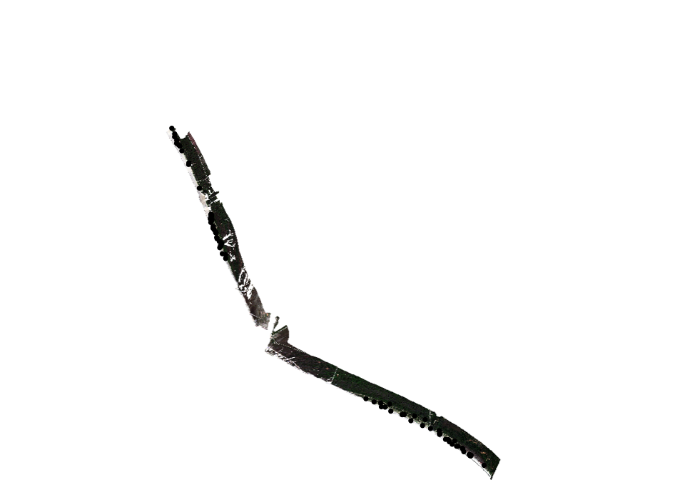
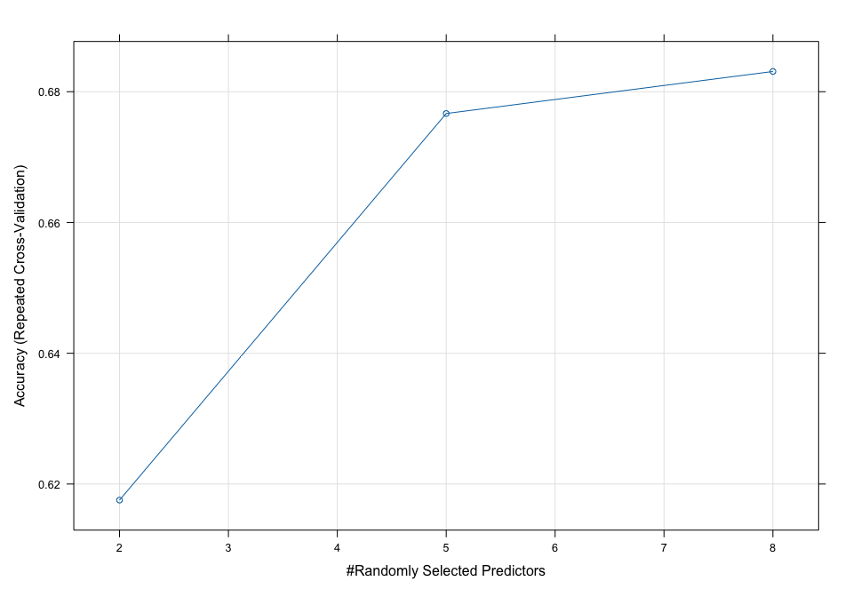
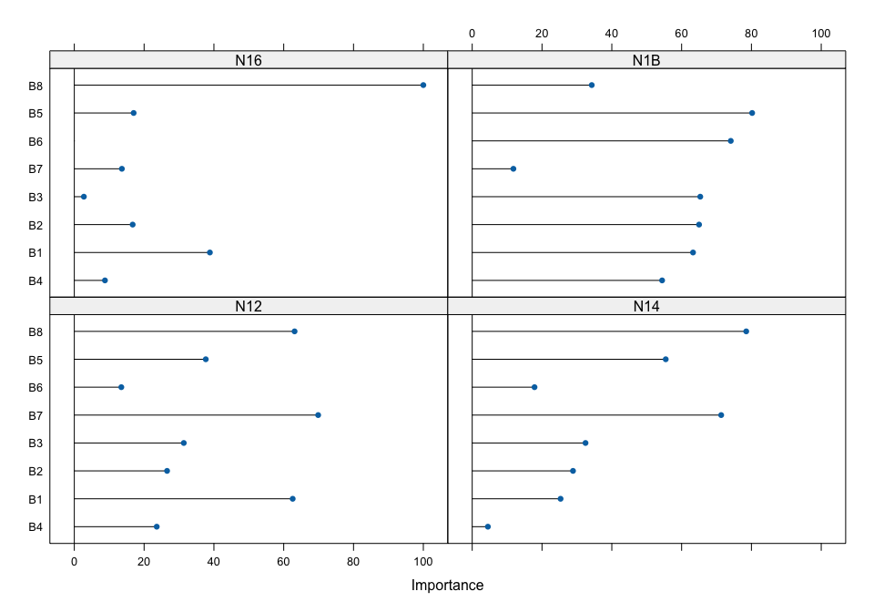
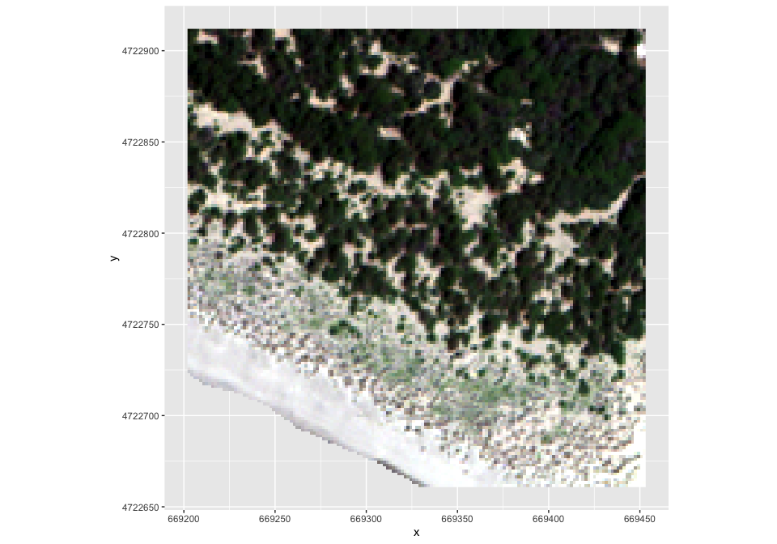
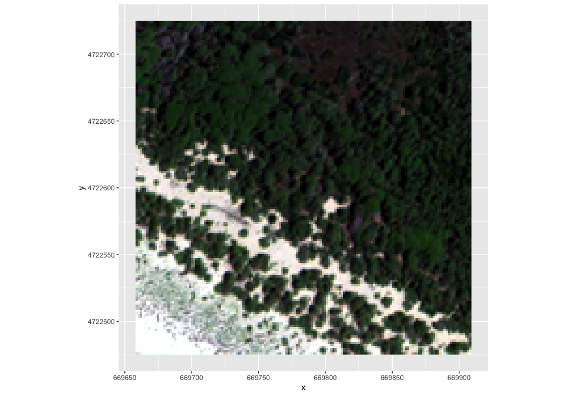
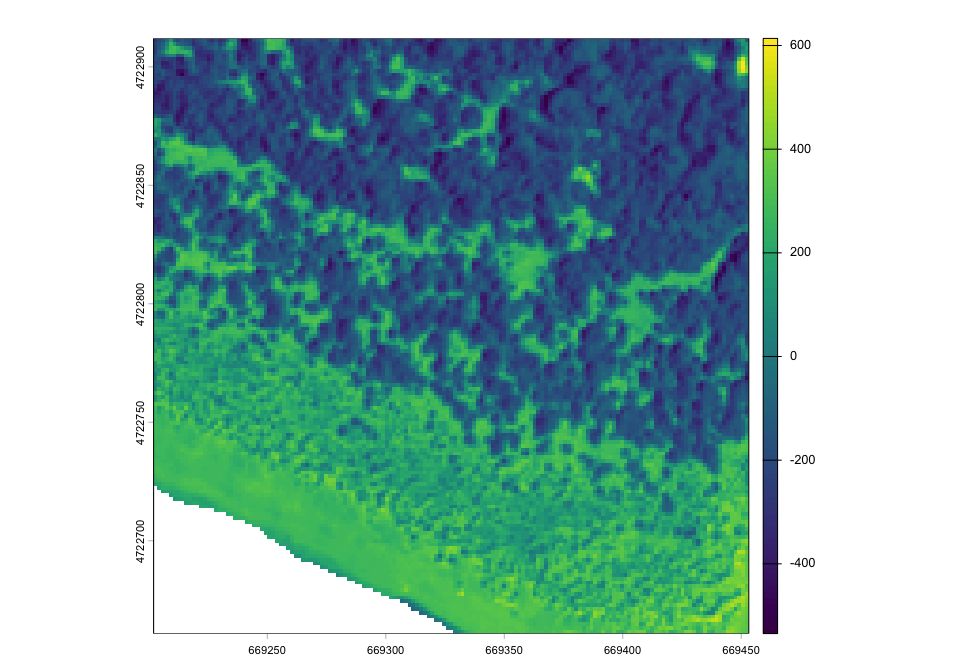
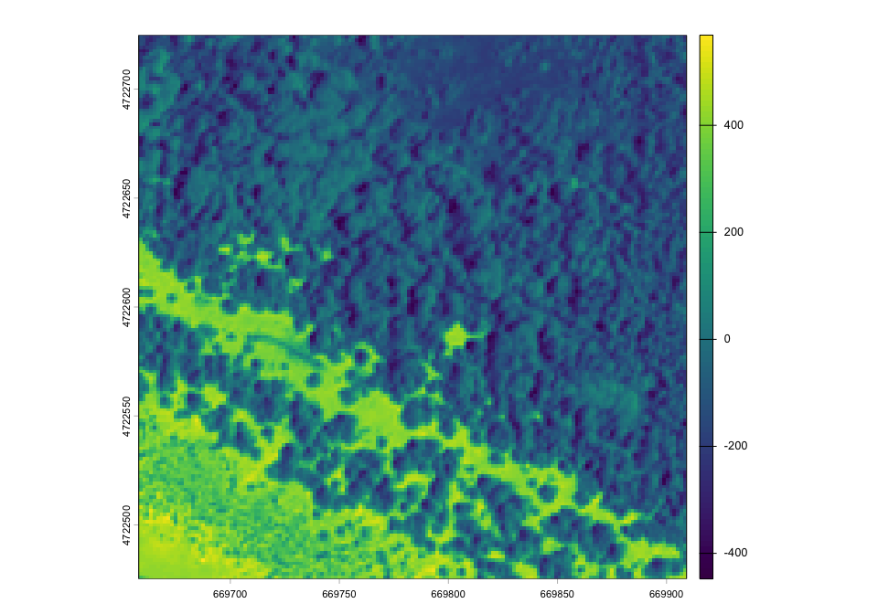

fuzzy-dunes-code
================

``` r
library(terra) # raster data
```

    ## terra 1.8.80

``` r
library(caret) # random forest
```

    ## Loading required package: ggplot2

    ## Loading required package: lattice

``` r
library(randomForest)
```

    ## randomForest 4.7-1.2

    ## Type rfNews() to see new features/changes/bug fixes.

    ## 
    ## Attaching package: 'randomForest'

    ## The following object is masked from 'package:ggplot2':
    ## 
    ##     margin

``` r
library(dplyr)
```

    ## 
    ## Attaching package: 'dplyr'

    ## The following object is masked from 'package:randomForest':
    ## 
    ##     combine

    ## The following objects are masked from 'package:terra':
    ## 
    ##     intersect, union

    ## The following objects are masked from 'package:stats':
    ## 
    ##     filter, lag

    ## The following objects are masked from 'package:base':
    ## 
    ##     intersect, setdiff, setequal, union

``` r
library(RStoolbox) # sam and mesma
```

    ## This is version 1.0.2.2 of RStoolbox

``` r
library(vegan) # dissimilarity matrix and mantel tests
```

    ## Loading required package: permute

    ## 
    ## Attaching package: 'vegan'

    ## The following object is masked from 'package:caret':
    ## 
    ##     tolerance

``` r
library(rasterdiv) # spectral heterogeneity
library(snow)
library(ggplot2)
library(ggpubr)
```

    ## 
    ## Attaching package: 'ggpubr'

    ## The following object is masked from 'package:terra':
    ## 
    ##     rotate

``` r
library(cowplot)
```

    ## 
    ## Attaching package: 'cowplot'

    ## The following object is masked from 'package:ggpubr':
    ## 
    ##     get_legend

``` r
library(viridis)
```

    ## Loading required package: viridisLite

``` r
library(rasterVis)
library(ggspatial)
```

# Image classifications: crisp and fuzzy

Note: here is the example for the image classifications performed for
EUNIS classes in Maremma Park. <br> For other classifications, select
other subsets (aoi: “Maremma”, “MSRM”; habitat: “eunis”, “annex_I”,
“cluster”). <br>

### Prepare data

``` r
aoi <- "Maremma"
habitat <- "eunis"

# Load reference shapefiles
shp_plots <- vect("Dune_plot.shp")
table(shp_plots$annex_I, useNA='always')
```

    ## 
    ## 1210 2110 2120 2210 2230 2250  NaN <NA> 
    ##    4   18   34   21    5   62  100    0

``` r
table(shp_plots$cluster, useNA='always')
```

    ## 
    ##   C1   C2   C3   C4   C5   C6 <NA> 
    ##   20   23   43   31   31   76   20

``` r
table(shp_plots$eunis, useNA='always')
```

    ## 
    ##  N12  N14  N16  N1B <NA> 
    ##   10   63   68   12   91

``` r
# Load ground truth species composition 
df_spe <- read.csv("plots_species.csv")

# Subset reference points
shp_plots <- subset(shp_plots, shp_plots$park == aoi, select=habitat)
names(shp_plots) <- "code"
table(shp_plots$code)
```

    ## 
    ## N12 N14 N16 N1B 
    ##   8  23  11   6

``` r
# Prepare training data: remove mixed plots
ta_data <- shp_plots[!is.na(shp_plots$code)]
ta_data$code <- factor(ta_data$code)
summary(ta_data)
```

    ##   code   
    ##  N12: 8  
    ##  N14:23  
    ##  N16:11  
    ##  N1B: 6

``` r
# Load raster data
WV_image <- rast(paste0("WV_", aoi, ".tif"))
names(WV_image) <- paste0('B', seq(1:8))
plotRGB(WV_image, r=5, g=3, b=2, stretch='lin')
plot(shp_plots, add=T)
```

<!-- -->

``` r
summary(WV_image)
```

    ## Warning: [summary] used a sample

    ##        B1              B2              B3              B4       
    ##  Min.   :224     Min.   :169.0   Min.   :148.0   Min.   :108.0  
    ##  1st Qu.:242     1st Qu.:198.0   1st Qu.:222.0   1st Qu.:197.0  
    ##  Median :248     Median :208.0   Median :243.0   Median :223.0  
    ##  Mean   :260     Mean   :227.7   Mean   :273.8   Mean   :266.6  
    ##  3rd Qu.:262     3rd Qu.:232.0   3rd Qu.:278.0   3rd Qu.:279.0  
    ##  Max.   :389     Max.   :440.0   Max.   :625.0   Max.   :748.0  
    ##  NA's   :95429   NA's   :95429   NA's   :95429   NA's   :95429  
    ##        B5              B6              B7              B8       
    ##  Min.   : 55.0   Min.   : 96.0   Min.   : 76.0   Min.   : 79.0  
    ##  1st Qu.:114.0   1st Qu.:293.0   1st Qu.:319.0   1st Qu.:335.0  
    ##  Median :135.0   Median :346.0   Median :380.0   Median :386.0  
    ##  Mean   :169.8   Mean   :352.7   Mean   :381.9   Mean   :384.7  
    ##  3rd Qu.:186.0   3rd Qu.:410.0   3rd Qu.:446.0   3rd Qu.:440.0  
    ##  Max.   :517.0   Max.   :751.0   Max.   :788.0   Max.   :714.0  
    ##  NA's   :95429   NA's   :95429   NA's   :95429   NA's   :95429

``` r
# Define two sample areas
MapExt1_Maremma <- ext(669202.6, 669452.6, 4722661.6, 4722911.6)
MapExt2_Maremma <- ext(669658.4, 669908.4, 4722475.3, 4722725.3)
MapExt1_MSRM <- ext(600095.9,600343.2,4855045.4,4855294.3)
MapExt2_MSRM <- ext(602461.0,602708.9,4845864.8,4846114.4)
```

``` r
# Extract raster values for training points
ta <- data.frame(terra::extract(WV_image, ta_data, ID=FALSE))
ta <- cbind(as.data.frame(ta_data), ta)
head(ta)
```

    ##   code  B1  B2  B3  B4  B5  B6  B7  B8
    ## 1  N14 324 337 468 517 352 502 439 418
    ## 2  N1B 244 199 245 221 118 385 451 450
    ## 3  N1B 243 194 214 194 113 252 235 283
    ## 4  N16 321 330 459 543 402 546 440 463
    ## 5  N1B 247 210 251 234 128 355 393 398
    ## 6  N1B 244 204 242 223 127 387 438 451

``` r
# Remove missing values
complete.cases(ta) # check if there are NAs
```

    ##  [1] TRUE TRUE TRUE TRUE TRUE TRUE TRUE TRUE TRUE TRUE TRUE TRUE TRUE TRUE TRUE
    ## [16] TRUE TRUE TRUE TRUE TRUE TRUE TRUE TRUE TRUE TRUE TRUE TRUE TRUE TRUE TRUE
    ## [31] TRUE TRUE TRUE TRUE TRUE TRUE TRUE TRUE TRUE TRUE TRUE TRUE TRUE TRUE TRUE
    ## [46] TRUE TRUE TRUE

``` r
dim(ta)
```

    ## [1] 48  9

``` r
ta <- na.omit(ta) # remove NAs
dim(ta)
```

    ## [1] 48  9

``` r
# Prepare training and test data sets
hre_seed <- 27
set.seed(hre_seed)
inTraining <- createDataPartition(ta$code,
                                  p = .7,
                                  list = FALSE)
training <- ta[inTraining, ]
testing <- ta[-inTraining, ]
shp_testing <- ta_data[-as.numeric(inTraining), ]

dim(training)
```

    ## [1] 36  9

``` r
dim(testing)
```

    ## [1] 12  9

``` r
# Endmembers from training data
mr_training <- aggregate(training[,-1], list(training$code), mean, na.rm=T)
rownames(mr_training) <- mr_training[,1]
mr_training <- mr_training[,-1]
mr_training <- as.matrix(mr_training)


# Dissimilarity matrix in vegetation plots
spe <- subset(df_spe, df_spe$park==aoi, select=c(-id, -park))
spe.ch <- decostand(spe, method='norm') # chord normalization
dist_veg <- vegdist(spe.ch, method='euclidean') # euclidean distances
```

### Crisp random forest

``` r
# Set up model tuning parameters
set.seed(hre_seed)
fitControl <- trainControl(
  method = 'repeatedcv', #repeated cross-validation
  number = 5, #number of resampling iterations
  repeats = 5 #number of subsets of folds
)

# Train the classifier
rf_model <- train(code~.,
                data=training,
                method='rf',
                trControl=fitControl,
                prox=TRUE,
                fitBest=FALSE,
                returnData=TRUE,
                importance=TRUE)

print(rf_model)
```

    ## Random Forest 
    ## 
    ## 36 samples
    ##  8 predictor
    ##  4 classes: 'N12', 'N14', 'N16', 'N1B' 
    ## 
    ## No pre-processing
    ## Resampling: Cross-Validated (5 fold, repeated 5 times) 
    ## Summary of sample sizes: 28, 28, 29, 30, 29, 30, ... 
    ## Resampling results across tuning parameters:
    ## 
    ##   mtry  Accuracy   Kappa    
    ##   2     0.6175397  0.4124784
    ##   5     0.6766667  0.4988020
    ##   8     0.6830952  0.5153355
    ## 
    ## Accuracy was used to select the optimal model using the largest value.
    ## The final value used for the model was mtry = 8.

``` r
plot(rf_model)
```

<!-- -->

``` r
# Check variable importance
rf_model$finalModel$importance
```

    ##            N12          N14          N16         N1B MeanDecreaseAccuracy
    ## B1 0.109700000  0.018490693  0.039266667 0.126500000           0.05309215
    ## B2 0.016333333  0.017327778  0.010766667 0.125000000           0.03097058
    ## B3 0.028500000  0.017000866 -0.001433333 0.127333333           0.03044031
    ## B4 0.014666667 -0.000267316  0.003033333 0.089833333           0.01576944
    ## B5 0.045800000  0.049418398  0.012766667 0.185666667           0.06048461
    ## B6 0.007333333  0.005977778 -0.003400000 0.175333333           0.02809590
    ## B7 0.143600000  0.059957504  0.005666667 0.003833333           0.05241718
    ## B8 0.113633333  0.081910606  0.225633333 0.045000000           0.11256574
    ##    MeanDecreaseGini
    ## B1         3.921245
    ## B2         2.120719
    ## B3         2.068120
    ## B4         1.451642
    ## B5         3.057987
    ## B6         1.954315
    ## B7         2.786491
    ## B8         6.494370

``` r
rf_varImp <- varImp(rf_model, compete=FALSE)
plot(rf_varImp)
```

<!-- -->

``` r
# Perform classification using the RF classifier
class_rf <- predict(WV_image, rf_model, type = "raw", na.rm=TRUE)
```

    ## |---------|---------|---------|---------|=========================================                                          

``` r
class_rf
```

    ## class       : SpatRaster 
    ## size        : 7915, 6059, 1  (nrow, ncol, nlyr)
    ## resolution  : 1.6, 1.6  (x, y)
    ## extent      : 662307.6, 672002, 4721302, 4733966  (xmin, xmax, ymin, ymax)
    ## coord. ref. : WGS 84 / UTM zone 32N (EPSG:32632) 
    ## source      : spat_10d4c5e9694ab_68940_SskviV5XwhZb4QV.tif 
    ## categories  : class 
    ## name        : class 
    ## min value   :   N12 
    ## max value   :   N1B

``` r
# Perform accuracy assessment
rf_pred <- predict(rf_model$finalModel, newdata=testing)

# Confusion matrix
rf_cm <- confusionMatrix(data=rf_pred, testing$code)
rf_cm_tab <- t(rf_cm$table)
rownames(rf_cm_tab) <- levels(ta_data$code)
colnames(rf_cm_tab) <- levels(ta_data$code)
rf_cm_tab
```

    ##          Prediction
    ## Reference N12 N14 N16 N1B
    ##       N12   2   0   0   0
    ##       N14   1   4   1   0
    ##       N16   0   1   2   0
    ##       N1B   0   0   0   1

``` r
# Overall accuracy
rf_cm$overall
```

    ##       Accuracy          Kappa  AccuracyLower  AccuracyUpper   AccuracyNull 
    ##     0.75000000     0.63265306     0.42814154     0.94513936     0.50000000 
    ## AccuracyPValue  McnemarPValue 
    ##     0.07299805            NaN

``` r
rf_oa <- rf_cm$overall[1]

# Class-specific accuracy metrics
rf_stats <- rbind(rf_cm_tab,  UA=diag(rf_cm_tab)/colSums(rf_cm_tab))
rf_stats <- cbind(rf_stats, PA=diag(rf_cm_tab)/rowSums(rf_cm_tab))
```

    ## Warning in cbind(rf_stats, PA = diag(rf_cm_tab)/rowSums(rf_cm_tab)): number of
    ## rows of result is not a multiple of vector length (arg 2)

``` r
rf_stats[nrow(rf_stats), ncol(rf_stats)] <- rf_oa
rf_stats <- round(rf_stats, 2)

# Map of classification uncertainty: Probability of the assigned class
rf_uncert <- predict(WV_image, rf_model$finalModel, na.rm=T, type="prob")
```

    ## |---------|---------|---------|---------|=========================================                                          

``` r
rf_uncert <- app(rf_uncert, max)
```

    ## |---------|---------|---------|---------|=========================================                                          

``` r
# Save results
# writeRaster(class_rf, paste0("class_", aoi, "_", habitat, "_rf.tif"), filetype="GTiff")
# writeRaster(rf_uncert, paste0("class_", aoi, "_", habitat, "_rf_uncert.tif"), filetype="GTiff")
# write.csv(rf_stats, paste0("class_", aoi, "_", habitat, "_rf_stats.csv"))

# Dissimilarity matrix in predicted map
rf_df <- terra::extract(class_rf, shp_plots, method='simple', ID=FALSE)
rf_df <- as.factor(rf_df$class)
rf_matrix <- matrix(0, nrow=length(rf_df), ncol=nlevels(rf_df), 
                    dimnames=list(NULL, levels(ta_data$code)))
for (i in 1:nlevels(rf_df)) {
  rf_matrix[, i] <- as.numeric(rf_df == levels(rf_df)[i])
}
dist_rf <- vegdist(rf_matrix, method='euclidean')

# Mantel test
mant_rf <- mantel(dist_veg, dist_rf, method='pearson')
```

<br> \### Fuzzy random forest

``` r
# Perform classification using the fuzzy RF classifier
class_frf <- predict(WV_image, rf_model$finalModel, na.rm=T, type="prob")
```

    ## |---------|---------|---------|---------|=========================================                                          

``` r
class_frf
```

    ## class       : SpatRaster 
    ## size        : 7915, 6059, 4  (nrow, ncol, nlyr)
    ## resolution  : 1.6, 1.6  (x, y)
    ## extent      : 662307.6, 672002, 4721302, 4733966  (xmin, xmax, ymin, ymax)
    ## coord. ref. : WGS 84 / UTM zone 32N (EPSG:32632) 
    ## source      : spat_10d4c64f5c4d8_68940_SDnwk7fjh8CwF05.tif 
    ## names       :   N12,   N14,   N16,  N1B 
    ## min values  : 0.000, 0.004, 0.000, 0.00 
    ## max values  : 0.968, 1.000, 0.992, 0.98

``` r
# Perform accuracy assessment
frf_pred <- data.frame(extract(class_frf, shp_testing, method='simple', ID=FALSE))
observed <- shp_testing$code
frf_matrix <- cbind(observed, round(frf_pred, 2))
names(frf_matrix) <- gsub('X', '', names(frf_matrix))

# Confusion matrix
frf_cm <- as.data.frame(frf_matrix %>% 
                          group_by(observed) %>% 
                          summarise(across(everything(), mean)))
rownames(frf_cm) <- frf_cm[, 1]
frf_cm <- frf_cm[, -1]
frf_cm <- as.matrix(frf_cm)
rowSums(frf_cm) # check each row sum up to 1
```

    ##  N12  N14  N16  N1B 
    ## 1.00 1.00 1.00 0.99

``` r
# Overall accuracy
frf_oa <- (sum(diag(frf_cm)))  / # sum of major diagonal
  (sum(frf_cm)) # sum of memberships found in reference data

# Class-specific accuracy metrics
frf_stats <- rbind(frf_cm,  UA=diag(frf_cm)/colSums(frf_cm))
frf_stats <- cbind(frf_stats, PA=diag(frf_cm)/rowSums(frf_cm))
```

    ## Warning in cbind(frf_stats, PA = diag(frf_cm)/rowSums(frf_cm)): number of rows
    ## of result is not a multiple of vector length (arg 2)

``` r
frf_stats[nrow(frf_stats), ncol(frf_stats)] <- frf_oa
frf_stats <- round(frf_stats, 2)

# Map of classification uncertainty: Probability Surplus Index
frf_ord <- app(class_frf, fun=function(X, na.rm) X[order(X, decreasing=T)])
```

    ## |---------|---------|---------|---------|=========================================                                          

``` r
frf_ord2 <- frf_ord[[2]] # second most probable class
frf_uncert <- max(class_frf) - frf_ord2 # probability surplus index
```

    ## |---------|---------|---------|---------|=========================================                                          

``` r
# Save results
# writeRaster(class_frf, paste0("class_", aoi, "_", habitat, "_frf.tif"), filetype="GTiff")
# writeRaster(frf_uncert, paste0("class_", aoi, "_", habitat, "_frf_uncert.tif"), filetype="GTiff")
# write.csv(frf_stats, paste0("class_", aoi, "_", habitat, "_frf_stats.csv"))

# Dissimilarity matrix in predicted map
frf_df <- terra::extract(class_frf, shp_plots, method='simple', ID=FALSE)
dist_frf <- vegdist(frf_df, method="euclidean")

# Mantel test
mant_frf <- mantel(dist_veg, dist_frf, method='pearson')
```

### Spectral angle mapper

``` r
# Spectral angle mapper
class_sam <- sam(WV_image, em = mr_training, angles = TRUE)
```

    ## |---------|---------|---------|---------|=========================================                                          

``` r
names(class_sam) <- sub('_sa', '', names(class_sam))
class_sam
```

    ## class       : SpatRaster 
    ## size        : 7915, 6059, 4  (nrow, ncol, nlyr)
    ## resolution  : 1.6, 1.6  (x, y)
    ## extent      : 662307.6, 672002, 4721302, 4733966  (xmin, xmax, ymin, ymax)
    ## coord. ref. : WGS 84 / UTM zone 32N (EPSG:32632) 
    ## source      : spat_10d4c39131ca4_68940_P2mm2aa9P9QX7pk.tif 
    ## names       :         N12,         N14,         N16,         N1B 
    ## min values  : 0.001683485, 0.004022456, 0.005093464, 0.004851664 
    ## max values  : 0.644642353, 0.602837324, 0.666892767, 0.721262634

``` r
# Convert spectral angles to probabilities
class_sam_maxLayer <- global(class_sam, max, na.rm=TRUE) # get max value for each layer
class_sam_maxPixel <- max(class_sam) # get max value for each pixel across layers
```

    ## |---------|---------|---------|---------|=========================================                                          

``` r
class_sam_norm <- class_sam/max(class_sam_maxLayer) # normalize angles to [0,1]
```

    ## |---------|---------|---------|---------|=========================================                                          

``` r
class_sam_normSim <- 1-class_sam_norm # invert angles (from dissimilarity to similarity)
```

    ## |---------|---------|---------|---------|=========================================                                          

``` r
class_sam_normSum <- sum(class_sam_normSim) # sum angles for each pixel
```

    ## |---------|---------|---------|---------|=========================================                                          

``` r
class_sam_prob <- class_sam_normSim/class_sam_normSum # compute probabilities
```

    ## |---------|---------|---------|---------|=========================================                                          

``` r
sum(class_sam_prob) # check each pixel sum up to 1
```

    ## |---------|---------|---------|---------|=========================================                                          

    ## class       : SpatRaster 
    ## size        : 7915, 6059, 1  (nrow, ncol, nlyr)
    ## resolution  : 1.6, 1.6  (x, y)
    ## extent      : 662307.6, 672002, 4721302, 4733966  (xmin, xmax, ymin, ymax)
    ## coord. ref. : WGS 84 / UTM zone 32N (EPSG:32632) 
    ## source(s)   : memory
    ## name        : sum 
    ## min value   :   1 
    ## max value   :   1

``` r
# Perform accuracy assessment
sam_pred <- terra::extract(class_sam_prob, shp_testing, method='simple', ID=FALSE)
colnames(sam_pred) <- sub('X', '', colnames(sam_pred)) 
colnames(sam_pred) <- sub('_sa', '', colnames(sam_pred)) 
observed <- shp_testing$code

# Confusion matrix
sam_matrix <- cbind(observed, round(sam_pred, 2))
sam_cm <- data.frame(sam_matrix %>% 
                       group_by(observed) %>% 
                       summarise(across(everything(), mean)))
rownames(sam_cm) <- sam_cm[, 1]
sam_cm <- sam_cm[, -1]
sam_cm <- as.matrix(sam_cm)
colnames(sam_cm) <- rownames(sam_cm)
rowSums(sam_cm) # check each row sum up to 1
```

    ##      N12      N14      N16      N1B 
    ## 1.005000 1.003333 1.000000 1.000000

``` r
# Overall accuracy
sam_oa <- (sum(diag(sam_cm)))  / # sum of major diagonal
  (sum(sam_cm)) # sum of memberships found in reference data

# Class-specific accuracy metrics
sam_stats <- rbind(sam_cm,  UA=diag(sam_cm)/colSums(sam_cm))
sam_stats <- cbind(sam_stats, PA=diag(sam_cm)/rowSums(sam_cm))
```

    ## Warning in cbind(sam_stats, PA = diag(sam_cm)/rowSums(sam_cm)): number of rows
    ## of result is not a multiple of vector length (arg 2)

``` r
sam_stats[nrow(sam_stats), ncol(sam_stats)] <- sam_oa
sam_stats <- round(sam_stats, 2)

# Map of classification uncertainty: Probability Surplus Index
sam_ord <- app(class_sam_prob, fun=function(X, na.rm) X[order(X, decreasing=T)])
```

    ## |---------|---------|---------|---------|=========================================                                          

``` r
sam_ord2 <- sam_ord[[2]] # second most probable class
sam_uncert <-max(class_sam_prob) - sam_ord2
```

    ## |---------|---------|---------|---------|=========================================                                          

``` r
# Save results
# writeRaster(class_sam_prob, paste0("class_", aoi, "_", habitat, "_sam.tif"), filetype="GTiff")
# writeRaster(sam_uncert, paste0("class_", aoi, "_", habitat, "_sam_uncert.tif"), filetype="GTiff")
# write.csv(sam_stats, paste0("class_", aoi, "_", habitat, "_sam_stats.csv"))

# Dissimilarity matrix in predicted map
sam_df <- terra::extract(class_sam_prob, shp_plots, method='simple', ID=FALSE) 
dist_sam <- vegdist(sam_df, method="euclidean")

# Mantel test
mant_sam <- mantel(dist_veg, dist_sam, method='pearson')
```

### Multiple Endmember Spectral Mixture Analysis

``` r
class_mesma <- mesma(WV_image, em = mr_training)
```

    ## |---------|---------|---------|---------|=========================================                                          |---------|---------|---------|---------|=========================================                                          

``` r
class_mesma
```

    ## class       : SpatRaster 
    ## size        : 7915, 6059, 5  (nrow, ncol, nlyr)
    ## resolution  : 1.6, 1.6  (x, y)
    ## extent      : 662307.6, 672002, 4721302, 4733966  (xmin, xmax, ymin, ymax)
    ## coord. ref. : WGS 84 / UTM zone 32N (EPSG:32632) 
    ## sources     : spat_10d4c566b0587_68940_AT5VdpNFVAMepv2.tif  
    ##               spat_10d4c566b0587_68940_AT5VdpNFVAMepv2.tif  
    ##               spat_10d4c566b0587_68940_AT5VdpNFVAMepv2.tif  
    ##               ... and 2 more sources
    ## names       : N12,       N14, N16, N1B,        RMSE 
    ## min values  :   0, 0.0000000,   0,   0,   0.6857393 
    ## max values  :   1, 0.5949214,   1,   1, 204.5206909

``` r
# Perform accuracy assessment
mesma_pred <- terra::extract(class_mesma, shp_testing, method='simple', ID=FALSE)
mesma_pred <- subset(mesma_pred, select=-RMSE)
colnames(mesma_pred) <- sub('X', '', colnames(mesma_pred))
observed <- shp_testing$code

# Confusion matrix
mesma_matrix <- cbind(observed, round(mesma_pred, 2))
mesma_cm <- data.frame(mesma_matrix %>%
                         group_by(observed) %>%
                         summarise(across(everything(), mean)))
rownames(mesma_cm) <- mesma_cm[,1]
mesma_cm <- mesma_cm[,-1]
mesma_cm <- as.matrix(mesma_cm)

# Overall accuracy
mesma_oa <- (sum(diag(mesma_cm)))  / # sum of major diagonal
  (sum(mesma_cm)) # sum of membership found in reference data

# Class-specific accuracy metrics
mesma_stats <- rbind(mesma_cm,  UA=diag(mesma_cm)/colSums(mesma_cm))
mesma_stats <- cbind(mesma_stats, PA=diag(mesma_cm)/rowSums(mesma_cm))
```

    ## Warning in cbind(mesma_stats, PA = diag(mesma_cm)/rowSums(mesma_cm)): number of
    ## rows of result is not a multiple of vector length (arg 2)

``` r
mesma_stats[nrow(mesma_stats), ncol(mesma_stats)] <- mesma_oa
mesma_stats <- round(mesma_stats, 2)

# Map of classification uncertainty: RMSE
mesma_uncert <- class_mesma$RMSE

# Save results
# writeRaster(class_mesma, paste0("class_", aoi, "_", habitat, "_mesma.tif"), filetype="GTiff")
# writeRaster(mesma_uncert, paste0("class_", aoi, "_", habitat, "_mesma_uncert.tif"), filetype="GTiff")
# write.csv(mesma_stats, paste0("class_", aoi, "_", habitat, "_mesma_stats.csv"))

# Dissimilarity matrix in predicted map
mesma_df <- terra::extract(class_mesma, shp_plots, method='simple', ID=FALSE)
dist_mesma <- vegdist(mesma_df, method="euclidean")

# Mantel test
mant_mesma <- mantel(dist_veg, dist_mesma, method='pearson')
```

### Synthesis of classification results

### Spectral heterogeneity

``` r
# Define two sample areas
MapExt1 <- if(aoi=="Maremma") {MapExt1_Maremma} else {MapExt1_MSRM}
WV_ext1 <- crop(WV_image, MapExt1)
ggRGB(WV_ext1, r=5, g=3, b=2, stretch='lin', geom_raster=T)
```

<!-- -->

``` r
MapExt2 <- if(aoi=="Maremma") {MapExt2_Maremma} else {MapExt2_MSRM}
WV_ext2 <- crop(WV_image, MapExt2)
ggRGB(WV_ext2, r=5, g=3, b=2, stretch='lin', geom_raster=T)
```

<!-- -->

``` r
# area 1 **************************
# Extract first principal component
pca1 <- rasterPCA(WV_ext1, nComp=1)
summary(pca1$model)
```

    ## Importance of components:
    ##                             Comp.1     Comp.2       Comp.3       Comp.4
    ## Standard deviation     219.9612528 91.7876972 13.853556102 12.267858318
    ## Proportion of Variance   0.8439657  0.1469608  0.003347765  0.002625246
    ## Cumulative Proportion    0.8439657  0.9909265  0.994274243  0.996899489
    ##                             Comp.5       Comp.6       Comp.7       Comp.8
    ## Standard deviation     9.589754905 7.3048171061 4.3761678772 3.6430496250
    ## Proportion of Variance 0.001604159 0.0009307888 0.0003340569 0.0002315062
    ## Cumulative Proportion  0.998503648 0.9994344370 0.9997684938 1.0000000000

``` r
plot(pca1$map)
```

<!-- -->

``` r
# Calculate standard deviation with moving window
sd1 <- focal(pca1$map, w=7, fun='sd')

# Calculate Rao's Q index
WV_list1 <- as.list(WV_ext1)
rao1 <- paRao(WV_list1, window=7, method='multidimension', np=8)
```

    ## Warning in paRao(WV_list1, window = 7, method = "multidimension", np = 8):
    ## Multidimension Rao's index is experimental and should be used with caution.

    ## Warning in paRao(WV_list1, window = 7, method = "multidimension", np = 8):
    ## Simplify=0. Rounding data to 0 decimal places.

    ## Warning in paRao(WV_list1, window = 7, method = "multidimension", np = 8):
    ## Input data are float numbers. Converting data to integer matrices.

    ## 
    ## ---- Starting Parallel Calculation ----
    ##   [o]  [o]  [o]
    ##   Code is now running on multiple cores...
    ##   Please wait for the process to complete.

    ## 
    ## 
    ## Processing alpha: 1 Moving Window: 7

    ## Warning in FUN(X[[i]], ...): 
    ##  One or more matrices contain NA's which will be treated as 0

    ## Warning in FUN(X[[i]], ...): 197192 cells process, it may take quite some time...

``` r
rao1_w7 <- rao1$window.7$alpha.1

# area 2 **************************
# Extract first principal component
pca2 <- rasterPCA(WV_ext2, nComp=1)
summary(pca2$model)
```

    ## Importance of components:
    ##                             Comp.1      Comp.2       Comp.3       Comp.4
    ## Standard deviation     212.5036474 108.6473020 14.952455940 13.093805182
    ## Proportion of Variance   0.7856185   0.2053604  0.003889591  0.002982707
    ## Cumulative Proportion    0.7856185   0.9909789  0.994868525  0.997851233
    ##                            Comp.5       Comp.6       Comp.7       Comp.8
    ## Standard deviation     7.32273705 6.6987971300 4.2234849024 2.6792154426
    ## Proportion of Variance 0.00093288 0.0007806791 0.0003103279 0.0001248804
    ## Cumulative Proportion  0.99878411 0.9995647917 0.9998751196 1.0000000000

``` r
plot(pca2$map)
```

<!-- -->

``` r
# Calculate standard deviation with moving window
sd2 <- focal(pca2$map, w=7, fun='sd')

# Calculate Rao's Q index
WV_list2 <- as.list(WV_ext2)
rao2 <- paRao(WV_list2, window=7, method='multidimension', np=8)
```

    ## Warning in paRao(WV_list2, window = 7, method = "multidimension", np = 8):
    ## Multidimension Rao's index is experimental and should be used with caution.

    ## Warning in paRao(WV_list2, window = 7, method = "multidimension", np = 8):
    ## Simplify=0. Rounding data to 0 decimal places.

    ## Warning in paRao(WV_list2, window = 7, method = "multidimension", np = 8):
    ## Input data are float numbers. Converting data to integer matrices.

    ## 
    ## ---- Starting Parallel Calculation ----
    ##   [o]  [o]  [o]
    ##   Code is now running on multiple cores...
    ##   Please wait for the process to complete.

    ## 
    ## 
    ## Processing alpha: 1 Moving Window: 7

    ## Warning in FUN(X[[i]], ...): 195936 cells process, it may take quite some time...

``` r
rao2_w7 <- rao2$window.7$alpha.1

# Save results
# writeRaster(sd1, paste0(aoi, '_sd_map1.tif'), filetype='GTiff')
# writeRaster(rao1_w7, paste0(aoi, '_rao_map1.tif'), filetype='GTiff')
# writeRaster(sd2, paste0(aoi, '_sd_map2.tif'), filetype='GTiff')
# writeRaster(rao2_w7, paste0(aoi, '_rao_map2.tif'), filetype='GTiff')
```

### Overall accuracy

``` r
# merge all accuracy results in a single table
# results_accuracy <- rbind(results_Maremma_eunis, results_Maremma_annex_I, results_Maremma_cluster,
#                           results_MSRM_eunis, results_MSRM_annex_I, results_MSRM_cluster)
# write.csv(results_accuracy, "results_accuracy.csv")
```
