fuzzy-dunes-figures
================

# Visualize outputs

## Maps produced from the classifications

``` r
# graphical parameters
MapTheme <- list(theme(
  axis.text = element_blank(),  
  axis.text.y = element_blank(),
  axis.ticks=element_blank(),
  axis.title = element_blank(),
  strip.text = element_text(size = 10), 
  strip.background = element_rect(fill = "transparent", colour = NA),
  legend.title = element_text(size = 10),
  legend.text = element_text(size= 8),
  panel.grid.minor = element_blank(),
  theme(plot.margin=ggplot2::margin(5,5,15,5, unit="mm"))
))  

col_Nat2000<-c('#f5f5f5', #1210
           '#dfc27d', #2110
           '#a6611a', #2120
           '#a2cdc6', #2210
           #'#8ddab1', #2230
           '#018571') #2250

col_clust<-c('#f5f5f5', #C1 (Cakile)
             '#dfc27d', #C2 (Thinopyrum)
             '#a6611a', #C3 (Calamagrostis)
             '#a2cdc6', #C4 (Helichrysum)
             #'#8ddab1', #C5 (Lomelosia)
             '#018571') #C6 (Juniperus)

col_EUNIS<-c('#f5f5f5', #N12
               '#a6611a', #N14
               '#a2cdc6', #N16
               '#018571') #N1B

labels_Nat2000 <- c('1210','2110','2120','2210','2250')
labels_EUNIS <- c('N12','N14','N16','N1B')
labels_clust <- c('C1','C2','C3','C4','C6')

# Define two sample areas
MapExt1_Maremma <- ext(669202.6, 669452.6, 4722661.6, 4722911.6)
MapExt2_Maremma <- ext(669658.4, 669908.4, 4722475.3, 4722725.3)
MapExt1_MSRM <- ext(600095.9,600343.2,4855045.4,4855294.3)
MapExt2_MSRM <- ext(602461.0,602708.9,4845864.8,4846114.4)


# note: here the figures are for Maremma as an example
aoi <- "Maremma"
MapExt1 <- if(aoi=="Maremma") {MapExt1_Maremma} else {MapExt1_MSRM}
MapExt2 <- if(aoi=="Maremma") {MapExt2_Maremma} else {MapExt2_MSRM}
MapExt <- MapExt1

WV_image <- rast(paste0("WV_", aoi, ".tif"))
names(WV_image) <- paste0('B', seq(1:8))

# Plot RGB image
A0 <- ggRGB(crop(WV_image, MapExt), r=5, g=3, b=2, stretch='lin', geom_raster=T)+
  MapTheme +
  coord_equal()+
  annotation_scale(plot_unit='m',style='bar',location='bl',width_hint=0.1,height=unit(0.1,'cm'),pad_x=unit(.5,'cm'), pad_y=unit(.1,'cm'))
```

    ## Coordinate system already present.
    ## ℹ Adding new coordinate system, which will replace the existing one.

``` r
print(A0)
```

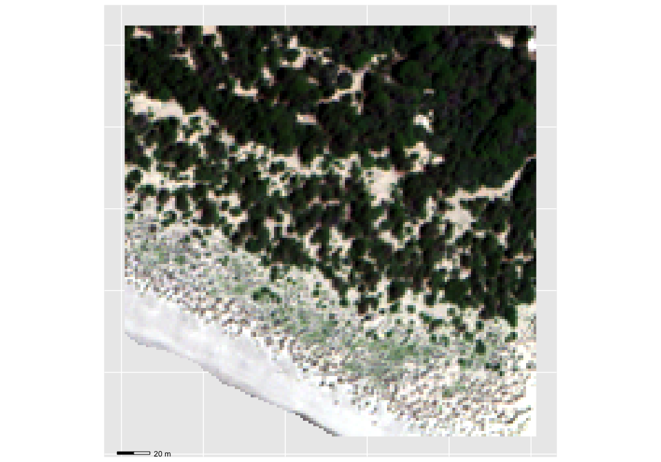<!-- -->

### Maps produced from crisp Random Forest classification

``` r
# Load classified maps
Map_Nat2000 <- rast(paste0("class_", aoi, "_annex_I_rf.tif"))
names(Map_Nat2000) <- 'Class'
Map_Nat2000[is.nan(Map_Nat2000)] <- NA

Map_EUNIS <- rast(paste0("class_", aoi, "_eunis_rf.tif"))
names(Map_EUNIS) <- 'Class'
Map_EUNIS[is.nan(Map_EUNIS)] <- NA

Map_clust <- rast(paste0("class_", aoi, "_cluster_rf.tif"))
names(Map_clust) <- 'Class'
Map_clust[is.nan(Map_clust)] <- NA

# Plot maps
A <- gplot(crop(Map_Nat2000, MapExt))+
  geom_raster(aes(fill=as.factor(value)))+
  scale_fill_manual(values=col_Nat2000, labels=labels_Nat2000, na.value='darkgrey')+
  labs(fill='Habitat')+
  MapTheme+ 
  coord_equal(clip="off") +
  annotation_scale(plot_unit='m',style='bar',location='bl',width_hint=0.1,height=unit(0.1,'cm'),pad_x=unit(3,'cm'), pad_y=unit(-0.25,'cm')) 

B <- gplot(crop(Map_clust, MapExt))+
  geom_tile(aes(fill=as.factor(value)))+
  scale_fill_manual(values=col_clust,labels=labels_clust,na.value='darkgrey',drop=T)+
  labs(fill='Habitat')+
  MapTheme+ 
  coord_equal(clip="off") +
  annotation_scale(plot_unit='m',style='bar',location='bl',width_hint=0.1,height=unit(0.1,'cm'),pad_x=unit(3,'cm'), pad_y=unit(-0.25,'cm')) 

C <- gplot(crop(Map_EUNIS, MapExt))+
  geom_tile(aes(fill=as.factor(value)))+
  scale_fill_manual(values=col_EUNIS,labels=labels_EUNIS,na.value='darkgrey')+
  labs(fill='Habitat')+
  MapTheme+ 
  coord_equal(clip="off") +
  annotation_scale(plot_unit='m',style='bar',location='bl',width_hint=0.1,height=unit(0.1,'cm'),pad_x=unit(3,'cm'), pad_y=unit(-0.25,'cm')) 

plot_grid(A,B,C, nrow=1, rel_heights=1, rel_widths=1, labels=c('A','B','C'), label_fontface='plain')
```

<!-- -->

``` r
ggsave('Fig3.png',width=20,height=6,units='cm',bg='transparent')
```

### Maps produced from fuzzy Random Forest classification

``` r
Map_Nat2000 <- rast(paste0("class_", aoi, "_annex_I_frf.tif"))
names(Map_Nat2000) <- labels_Nat2000
Map_Nat2000[is.nan(Map_Nat2000)] <- NA
```

    ## |---------|---------|---------|---------|=========================================                                          |---------|---------|---------|---------|=========================================                                          

``` r
Map_EUNIS <- rast(paste0("class_", aoi, "_eunis_frf.tif"))
names(Map_EUNIS) <- labels_EUNIS
Map_EUNIS[is.nan(Map_EUNIS)] <- NA
```

    ## |---------|---------|---------|---------|=========================================                                          |---------|---------|---------|---------|=========================================                                          

``` r
Map_clust <- rast(paste0("class_", aoi, "_cluster_frf.tif"))
names(Map_clust) <- labels_clust
Map_clust[is.nan(Map_clust)] <- NA
```

    ## |---------|---------|---------|---------|=========================================                                          |---------|---------|---------|---------|=========================================                                          

``` r
A <- gplot(crop(Map_Nat2000, MapExt))+
  geom_tile(aes(fill=value))+
  facet_wrap(~ variable, nrow=1)+ 
  scale_fill_viridis(name = "Probability") + MapTheme + 
  coord_equal(clip="off") +
  annotation_scale(plot_unit='m',style='bar',location='bl',width_hint=0.1,height=unit(0.1,'cm'),pad_x=unit(1.5,'cm'), pad_y=unit(-0.25,'cm')) 

B <- gplot(crop(Map_clust, MapExt))+
  geom_tile(aes(fill=value))+
  facet_wrap(~ variable, nrow=1) +
  scale_fill_viridis(name = "Probability") + MapTheme + 
  coord_equal(clip="off") +
  annotation_scale(plot_unit='m',style='bar',location='bl',width_hint=0.1,height=unit(0.1,'cm'),pad_x=unit(1.5,'cm'), pad_y=unit(-0.25,'cm')) 

C <- gplot(crop(Map_EUNIS, MapExt))+
  geom_tile(aes(fill=value))+
  facet_wrap(~ variable, nrow=1) +
  scale_fill_viridis(name = "Probability")+ MapTheme +
  coord_equal(clip="off") +
  annotation_scale(plot_unit='m',style='bar',location='bl',width_hint=0.1,height=unit(0.1,'cm'),pad_x=unit(1.5,'cm'), pad_y=unit(-0.25,'cm')) 

legend <- cowplot::get_legend(C)
plot_grid(A + theme(legend.position="none"),
          B + theme(legend.position="none"),
          plot_grid(C + theme(legend.position="none"),
                    legend, ncol=2, rel_widths=c(4,1)),
          ncol=1, nrow=3, rel_heights=1, rel_widths=1, 
          labels="AUTO", label_fontface='plain')
```

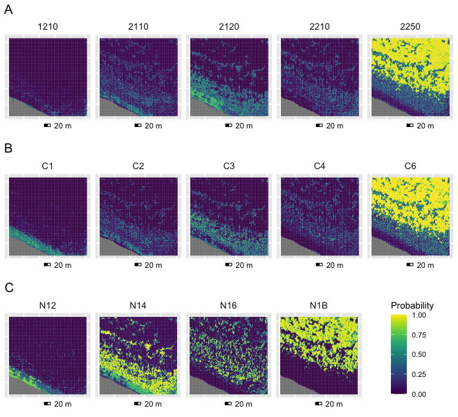<!-- -->

``` r
ggsave('Fig4.png',width=16,height=15,units='cm',bg='white')
```

### Maps produced from fuzzy Spectral Angle Mapper classification

``` r
Map_Nat2000 <- rast(paste0("class_", aoi, "_annex_I_sam.tif"))
names(Map_Nat2000) <- labels_Nat2000
Map_Nat2000[is.nan(Map_Nat2000)] <- NA
```

    ## |---------|---------|---------|---------|=========================================                                          |---------|---------|---------|---------|=========================================                                          

``` r
Map_EUNIS <- rast(paste0("class_", aoi, "_eunis_sam.tif"))
names(Map_EUNIS) <- labels_EUNIS
Map_EUNIS[is.nan(Map_EUNIS)] <- NA
```

    ## |---------|---------|---------|---------|=========================================                                          |---------|---------|---------|---------|=========================================                                          

``` r
Map_clust <- rast(paste0("class_", aoi, "_cluster_sam.tif"))
names(Map_clust) <- labels_clust
Map_clust[is.nan(Map_clust)] <- NA
```

    ## |---------|---------|---------|---------|=========================================                                          |---------|---------|---------|---------|=========================================                                          

``` r
A <- gplot(crop(Map_Nat2000, MapExt))+
  geom_tile(aes(fill=value))+
  facet_wrap(~ variable, nrow=1)+
  scale_fill_viridis(name = "Probability",direction=1) + MapTheme + 
  coord_equal(clip="off") +
  annotation_scale(plot_unit='m',style='bar',location='bl',width_hint=0.1,height=unit(0.1,'cm'),pad_x=unit(1.5,'cm'), pad_y=unit(-0.25,'cm')) 

B <- gplot(crop(Map_clust, MapExt))+
  geom_tile(aes(fill=value))+
  facet_wrap(~ variable, nrow=1) +
  scale_fill_viridis(name = "Probability",direction=1) + MapTheme + 
  coord_equal(clip="off") +
  annotation_scale(plot_unit='m',style='bar',location='bl',width_hint=0.1,height=unit(0.1,'cm'),pad_x=unit(1.5,'cm'), pad_y=unit(-0.25,'cm')) 

C <- gplot(crop(Map_EUNIS, MapExt))+
  geom_tile(aes(fill=value))+
  facet_wrap(~ variable, nrow=1) +
  scale_fill_viridis(name = "Probability",direction=1) + MapTheme + 
  coord_equal(clip="off") +
  annotation_scale(plot_unit='m',style='bar',location='bl',width_hint=0.1,height=unit(0.1,'cm'),pad_x=unit(1.5,'cm'), pad_y=unit(-0.25,'cm')) 

legend <- cowplot::get_legend(C)
plot_grid(A+theme(legend.position="none"),
          B+theme(legend.position="none"),
          plot_grid(C+theme(legend.position="none"),
                    legend, ncol=2, rel_widths=c(4,1)),
          ncol=1, nrow=3, rel_heights=1, rel_widths=1, 
          labels=c('A','B','C'), label_fontface='plain')
```

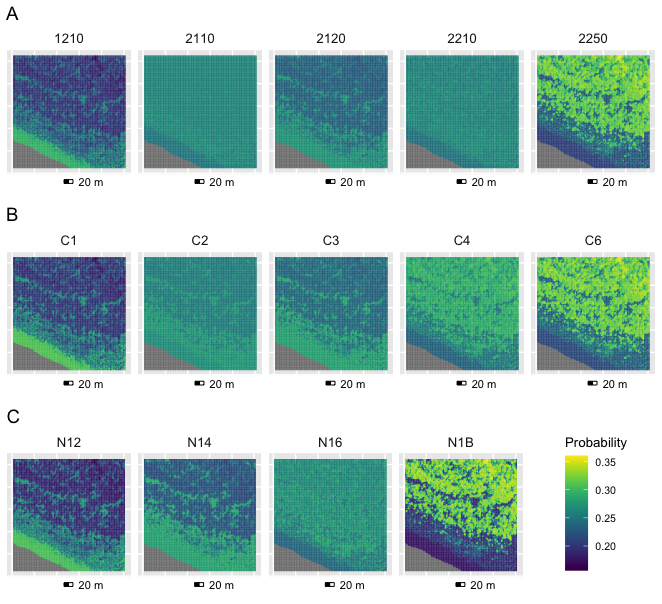<!-- -->

``` r
ggsave('FigS1.png',width=16,height=15,units='cm',bg='white')
```

### Maps produced from fuzzy Multiple Endmember Spectral Mixture Analysis

``` r
Map_Nat2000 <- rast(paste0("class_", aoi, "_annex_I_mesma.tif"))
Map_Nat2000 <- Map_Nat2000[[1:5]]
names(Map_Nat2000) <- labels_Nat2000
Map_Nat2000[is.nan(Map_Nat2000)] <- NA
```

    ## |---------|---------|---------|---------|=========================================                                          |---------|---------|---------|---------|=========================================                                          

``` r
Map_EUNIS <- rast(paste0("class_", aoi, "_eunis_mesma.tif"))
Map_EUNIS <- Map_EUNIS[[1:4]]
names(Map_EUNIS) <- labels_EUNIS
Map_EUNIS[is.nan(Map_EUNIS)] <- NA
```

    ## |---------|---------|---------|---------|=========================================                                          |---------|---------|---------|---------|=========================================                                          

``` r
Map_clust <- rast(paste0("class_", aoi, "_cluster_mesma.tif"))
Map_clust <- Map_clust[[1:5]]
names(Map_clust) <- labels_clust
Map_clust[is.nan(Map_clust)] <- NA
```

    ## |---------|---------|---------|---------|=========================================                                          |---------|---------|---------|---------|=========================================                                          

``` r
A <- gplot(crop(Map_Nat2000, MapExt))+
  geom_tile(aes(fill=value))+
  facet_wrap(~ variable, nrow=1) +
  scale_fill_viridis(name = "Probability") + MapTheme + 
  coord_equal(clip="off") +
  annotation_scale(plot_unit='m',style='bar',location='bl',width_hint=0.1,height=unit(0.1,'cm'),pad_x=unit(1.5,'cm'), pad_y=unit(-0.25,'cm')) 

B <- gplot(crop(Map_clust, MapExt))+
  geom_tile(aes(fill=value))+
  facet_wrap(~ variable, nrow=1) +
  scale_fill_viridis(name = "Probability") + MapTheme + 
  coord_equal(clip="off") +
  annotation_scale(plot_unit='m',style='bar',location='bl',width_hint=0.1,height=unit(0.1,'cm'),pad_x=unit(1.5,'cm'), pad_y=unit(-0.25,'cm')) 

C <- gplot(crop(Map_EUNIS, MapExt))+
  geom_tile(aes(fill=value))+
  facet_wrap(~ variable, nrow=1) +
  scale_fill_viridis(name = "Probability") + MapTheme + 
  coord_equal(clip="off") +
  annotation_scale(plot_unit='m',style='bar',location='bl',width_hint=0.1,height=unit(0.1,'cm'),pad_x=unit(1.5,'cm'), pad_y=unit(-0.25,'cm')) 

legend <- cowplot::get_legend(C)
plot_grid(A+theme(legend.position="none"),
          B+theme(legend.position="none"),
          plot_grid(C+theme(legend.position="none"),
                    legend, ncol=2, rel_widths=c(4,1)),
          ncol=1, nrow=3, rel_heights=1, rel_widths=1,
          labels=c('A','B','C'), label_fontface='plain')
```

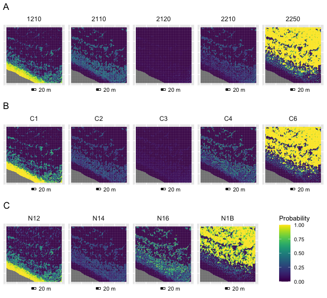<!-- -->

``` r
ggsave('FigS2.png',width=16,height=15,units='cm',bg='transparent')
```

## Maps of heterogeneity and uncertainty

``` r
# load spatial uncertainty data
Mar_RF_Nat2000_prob <- rast('class_Maremma_annex_I_rf_uncert.tif')
Mar_RF_clust_prob <- rast('class_Maremma_cluster_rf_uncert.tif')
Mar_RF_EUNIS_prob <- rast('class_Maremma_eunis_rf_uncert.tif')

Mar_RF_Nat2000_psi <- rast('class_Maremma_annex_I_frf_uncert.tif')
Mar_RF_clust_psi <- rast('class_Maremma_cluster_frf_uncert.tif')
Mar_RF_EUNIS_psi <- rast('class_Maremma_eunis_frf_uncert.tif')

Mar_SAM_Nat2000_psi <- rast('class_Maremma_annex_I_sam_uncert.tif')
Mar_SAM_clust_psi <- rast('class_Maremma_cluster_sam_uncert.tif')
Mar_SAM_EUNIS_psi <- rast('class_Maremma_eunis_sam_uncert.tif')

Mar_MESMA_Nat2000_rmse <- rast('class_Maremma_annex_I_mesma_uncert.tif')
Mar_MESMA_clust_rmse <- rast('class_Maremma_cluster_mesma_uncert.tif')
Mar_MESMA_EUNIS_rmse <- rast('class_Maremma_eunis_mesma_uncert.tif')

MSRM_RF_Nat2000_prob <- rast('class_MSRM_annex_I_rf_uncert.tif')
MSRM_RF_clust_prob <- rast('class_MSRM_cluster_rf_uncert.tif')
MSRM_RF_EUNIS_prob <- rast('class_MSRM_eunis_rf_uncert.tif')

MSRM_RF_Nat2000_psi <- rast('class_MSRM_annex_I_frf_uncert.tif')
MSRM_RF_clust_psi <- rast('class_MSRM_cluster_frf_uncert.tif')
MSRM_RF_EUNIS_psi <- rast('class_MSRM_eunis_frf_uncert.tif')

MSRM_SAM_Nat2000_psi <- rast('class_MSRM_annex_I_sam_uncert.tif')
MSRM_SAM_clust_psi <- rast('class_MSRM_cluster_sam_uncert.tif')
MSRM_SAM_EUNIS_psi <- rast('class_MSRM_eunis_sam_uncert.tif')

MSRM_MESMA_Nat2000_rmse <- rast('class_MSRM_annex_I_mesma_uncert.tif')
MSRM_MESMA_clust_rmse <- rast('class_MSRM_cluster_mesma_uncert.tif')
MSRM_MESMA_EUNIS_rmse <- rast('class_MSRM_eunis_mesma_uncert.tif')

# load spectral heterogeneity data
sd1 <- rast("Maremma_sd_map1.tif")
rao1 <- rast("Maremma_rao_map1.tif")

sd2 <- rast("MSRM_sd_map2.tif")
rao2 <- rast("MSRM_rao_map2.tif")

# load input raster images
WV_Maremma <- rast('WV_Maremma.tif')
WV_MSRM <- rast('WV_MSRM.tif')

MapExt1 <- MapExt1_Maremma
MapExt2 <- MapExt2_MSRM

WV_ext1 <- crop(WV_Maremma, MapExt1)
WV_ext2 <- crop(WV_MSRM, MapExt2)
```

``` r
# Images of input rasters ##################################
rgb1 <- ggRGB(WV_ext1,r=5,g=3,b=2,stretch='lin',geom_raster=T) + MapTheme +
  coord_equal(clip="off") +
  annotation_scale(plot_unit='m',style='bar',location='bl',width_hint=0.1,height=unit(0.1,'cm'),pad_x=unit(2.5,'cm'), pad_y=unit(-0.25,'cm')) 
```

    ## Coordinate system already present.
    ## ℹ Adding new coordinate system, which will replace the existing one.

``` r
rgb2 <- ggRGB(WV_ext2,r=5,g=3,b=2,stretch='lin',geom_raster=T) + MapTheme +
  coord_equal(clip="off") +
  annotation_scale(plot_unit='m',style='bar',location='bl',width_hint=0.1,height=unit(0.1,'cm'),pad_x=unit(2.5,'cm'), pad_y=unit(-0.25,'cm')) 
```

    ## Coordinate system already present.
    ## ℹ Adding new coordinate system, which will replace the existing one.

``` r
# Comparison between spectral heterogeneity (sd) and classification uncertainty ##################################

plot_sd1 <- ggR(sd1, geom_raster=T)+ 
  scale_fill_viridis(name = "Standard\ndeviation",option='G') + MapTheme +
  coord_equal(clip="off") +
  annotation_scale(plot_unit='m',style='bar',location='bl',width_hint=0.1,height=unit(0.1,'cm'),pad_x=unit(2.5,'cm'), pad_y=unit(-0.25,'cm')) 
```

    ## Coordinate system already present.
    ## ℹ Adding new coordinate system, which will replace the existing one.

``` r
plot_psi1 <- ggR(crop(Mar_RF_Nat2000_psi, MapExt1), geom_raster=T)+ 
  scale_fill_viridis(name = "Probability\nsurplus index",option='G',
                     direction=1) + 
  MapTheme + 
  coord_equal(clip="off") +
  annotation_scale(plot_unit='m',style='bar',location='bl',width_hint=0.1,height=unit(0.1,'cm'),pad_x=unit(2.5,'cm'), pad_y=unit(-0.25,'cm')) 
```

    ## Coordinate system already present.
    ## ℹ Adding new coordinate system, which will replace the existing one.

``` r
plot_1 <- plot_grid(rgb1, plot_sd1, plot_psi1, nrow=1,
                        rel_heights=c(0.67,1,1,1), rel_widths=c(0.67,1,1,1),  
                        labels=c('A','B','C'), label_fontface='plain')

plot_sd2 <- ggR(sd2, geom_raster=T)+ 
  scale_fill_viridis(name = "Standard\ndeviation",option='G') + MapTheme+
  coord_equal(clip="off") +
  annotation_scale(plot_unit='m',style='bar',location='bl',width_hint=0.1,height=unit(0.1,'cm'),pad_x=unit(2.5,'cm'), pad_y=unit(-0.25,'cm')) 
```

    ## Coordinate system already present.
    ## ℹ Adding new coordinate system, which will replace the existing one.

``` r
plot_psi2 <- ggR(crop(MSRM_RF_Nat2000_psi,MapExt2), geom_raster=T)+ 
  scale_fill_viridis(name = "Probability\nsurplus index",option='G',direction=1) + MapTheme+
  coord_equal(clip="off") +
  annotation_scale(plot_unit='m',style='bar',location='bl',width_hint=0.1,height=unit(0.1,'cm'),pad_x=unit(2.5,'cm'), pad_y=unit(-0.25,'cm')) 
```

    ## Coordinate system already present.
    ## ℹ Adding new coordinate system, which will replace the existing one.

``` r
plot_2 <- plot_grid(rgb2, plot_sd2, plot_psi2, nrow=1,
                  rel_heights=c(0.67,1,1,1), rel_widths=c(0.67,1,1,1),  
                  labels=c('D','E','F'), label_fontface='plain')

ggarrange(plot_1, NULL, plot_2,NULL, nrow=4, heights=c(1,.1,1,.1,1))
```

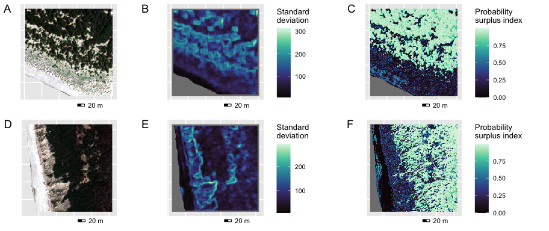<!-- -->

``` r
ggsave('Fig6.png',width=24,height=10,units='cm',bg='white')
```

``` r
# Map of Rao heterogeneity for two sample areas ##################################

plot_rao1 <- ggR(rao1, geom_raster=T)+ 
  scale_fill_viridis(name = "Rao",option='G', limits=c(0,400)) + MapTheme +
  coord_equal(clip="off") +
  annotation_scale(plot_unit='m',style='bar',location='bl',width_hint=0.1,height=unit(0.1,'cm'),pad_x=unit(2.5,'cm'), pad_y=unit(-0.25,'cm')) 
```

    ## Coordinate system already present.
    ## ℹ Adding new coordinate system, which will replace the existing one.

``` r
plot_rao2 <- ggR(rao2, geom_raster=T)+ 
  scale_fill_viridis(name = "Rao",option='G', limits=c(0,400)) + MapTheme +
  coord_equal(clip="off") +
  annotation_scale(plot_unit='m',style='bar',location='bl',width_hint=0.1,height=unit(0.1,'cm'),pad_x=unit(2.5,'cm'), pad_y=unit(-0.25,'cm')) 
```

    ## Coordinate system already present.
    ## ℹ Adding new coordinate system, which will replace the existing one.

``` r
legends_rao <- get_legend(plot_rao1)
plot_grid(plot_rao1,plot_rao2,nrow=1,labels='AUTO',label_fontface='plain')
```

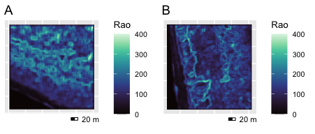<!-- -->

``` r
ggsave('FigS3.png',width=12,height=5,units='cm',bg='white')
```

``` r
# Maps of classification uncertainty ##################################

# uncertainty from RF crisp  *******************************************
plot_cr1a <- ggR(crop(Mar_RF_Nat2000_prob, MapExt1), geom_raster=T)+ 
  scale_fill_viridis(name = "Probability",option='G', direction=1, limits=c(0,1)) + 
  MapTheme + ggtitle('Annex I')+
  coord_equal(clip="off") +
  annotation_scale(plot_unit='m',style='bar',location='bl',width_hint=0.1,
                   height=unit(0.1,'cm'),pad_x=unit(2.5,'cm'), pad_y=unit(-0.2,'cm')) 
```

    ## Coordinate system already present.
    ## ℹ Adding new coordinate system, which will replace the existing one.

``` r
plot_cr1b <- ggR(crop(Mar_RF_clust_prob,MapExt1), geom_raster=T)+ 
  scale_fill_viridis(name = "Probability",option='G', direction=1, limits=c(0,1)) + 
  MapTheme + ggtitle('Noise clusters') +
  coord_equal(clip="off") +
  annotation_scale(plot_unit='m',style='bar',location='bl',width_hint=0.1,
                   height=unit(0.1,'cm'),pad_x=unit(2.5,'cm'), pad_y=unit(-0.2,'cm')) 
```

    ## Coordinate system already present.
    ## ℹ Adding new coordinate system, which will replace the existing one.

``` r
plot_cr1c <- ggR(crop(Mar_RF_EUNIS_prob,MapExt1), geom_raster=T)+ 
  scale_fill_viridis(name = "Probability",option='G', direction=1, limits=c(0,1)) + 
  MapTheme + ggtitle('EUNIS') +
  coord_equal(clip="off") +
  annotation_scale(plot_unit='m',style='bar',location='bl',width_hint=0.1,
                   height=unit(0.1,'cm'),pad_x=unit(2.5,'cm'), pad_y=unit(-0.2,'cm')) 
```

    ## Coordinate system already present.
    ## ℹ Adding new coordinate system, which will replace the existing one.

``` r
plot_cr2a <- ggR(crop(MSRM_RF_Nat2000_prob,MapExt2), geom_raster=T)+ 
  scale_fill_viridis(name = "Probability",option='G', direction=1, limits=c(0,1)) + 
  MapTheme + ggtitle('Annex I')+
  coord_equal(clip="off") +
  annotation_scale(plot_unit='m',style='bar',location='bl',width_hint=0.1,
                   height=unit(0.1,'cm'),pad_x=unit(2.5,'cm'), pad_y=unit(-0.2,'cm')) 
```

    ## Coordinate system already present.
    ## ℹ Adding new coordinate system, which will replace the existing one.

``` r
plot_cr2b <- ggR(crop(MSRM_RF_clust_prob,MapExt2), geom_raster=T)+ 
  scale_fill_viridis(name = "Probability",option='G', direction=1, limits=c(0,1)) + 
  MapTheme + ggtitle('Noise clusters') +
  coord_equal(clip="off") +
  annotation_scale(plot_unit='m',style='bar',location='bl',width_hint=0.1,
                   height=unit(0.1,'cm'),pad_x=unit(2.5,'cm'), pad_y=unit(-0.2,'cm')) 
```

    ## Coordinate system already present.
    ## ℹ Adding new coordinate system, which will replace the existing one.

``` r
plot_cr2c <- ggR(crop(MSRM_RF_EUNIS_prob,MapExt2), geom_raster=T)+ 
  scale_fill_viridis(name = "Probability",option='G', direction=1, limits=c(0,1)) + 
  MapTheme + ggtitle('EUNIS') +
  coord_equal(clip="off") +
  annotation_scale(plot_unit='m',style='bar',location='bl',width_hint=0.1,
                   height=unit(0.1,'cm'),pad_x=unit(2.5,'cm'), pad_y=unit(-0.2,'cm')) 
```

    ## Coordinate system already present.
    ## ℹ Adding new coordinate system, which will replace the existing one.

``` r
# uncertainty from RF fuzzy *******************************************
plot_psi1a <- ggR(crop(Mar_RF_Nat2000_psi,MapExt1), geom_raster=T)+ 
  scale_fill_viridis(name = "Probability\nsurplus index",option='G', direction=1, limits=c(0,1)) + 
  MapTheme + ggtitle('Annex I') +
  coord_equal(clip="off") +
  annotation_scale(plot_unit='m',style='bar',location='bl',width_hint=0.1,
                   height=unit(0.1,'cm'),pad_x=unit(2.5,'cm'), pad_y=unit(-0.2,'cm')) 
```

    ## Coordinate system already present.
    ## ℹ Adding new coordinate system, which will replace the existing one.

``` r
plot_psi1b <- ggR(crop(Mar_RF_clust_psi,MapExt1), geom_raster=T)+ 
  scale_fill_viridis(name = "Probability\nsurplus index",option='G',
                     direction=1, limits=c(0,1)) + 
  MapTheme + ggtitle('Noise clusters') +
  coord_equal(clip="off") +
  annotation_scale(plot_unit='m',style='bar',location='bl',width_hint=0.1,
                   height=unit(0.1,'cm'),pad_x=unit(2.5,'cm'), pad_y=unit(-0.2,'cm')) 
```

    ## Coordinate system already present.
    ## ℹ Adding new coordinate system, which will replace the existing one.

``` r
plot_psi1c <- ggR(crop(Mar_RF_EUNIS_psi,MapExt1), geom_raster=T)+ 
  scale_fill_viridis(name = "Probability\nsurplus index",option='G',
                     direction=1, limits=c(0,1)) + 
  MapTheme + ggtitle('EUNIS') +
  coord_equal(clip="off") +
  annotation_scale(plot_unit='m',style='bar',location='bl',width_hint=0.1,
                   height=unit(0.1,'cm'),pad_x=unit(2.5,'cm'), pad_y=unit(-0.2,'cm')) 
```

    ## Coordinate system already present.
    ## ℹ Adding new coordinate system, which will replace the existing one.

``` r
plot_psi2a <- ggR(crop(MSRM_RF_Nat2000_psi,MapExt2), geom_raster=T)+ 
  scale_fill_viridis(name = "Probability\nsurplus index",option='G',
                     direction=1, limits=c(0,1)) + 
  MapTheme + ggtitle('Annex I') +
  coord_equal(clip="off") +
  annotation_scale(plot_unit='m',style='bar',location='bl',width_hint=0.1,
                   height=unit(0.1,'cm'),pad_x=unit(2.5,'cm'), pad_y=unit(-0.2,'cm')) 
```

    ## Coordinate system already present.
    ## ℹ Adding new coordinate system, which will replace the existing one.

``` r
plot_psi2b <- ggR(crop(MSRM_RF_clust_psi,MapExt2), geom_raster=T)+ 
  scale_fill_viridis(name = "Probability\nsurplus index",option='G',
                     direction=1, limits=c(0,1)) + 
  MapTheme + ggtitle('Noise clusters') +
  coord_equal(clip="off") +
  annotation_scale(plot_unit='m',style='bar',location='bl',width_hint=0.1,
                   height=unit(0.1,'cm'),pad_x=unit(2.5,'cm'), pad_y=unit(-0.2,'cm')) 
```

    ## Coordinate system already present.
    ## ℹ Adding new coordinate system, which will replace the existing one.

``` r
plot_psi2c <- ggR(crop(MSRM_RF_EUNIS_psi,MapExt2), geom_raster=T)+ 
  scale_fill_viridis(name = "Probability\nsurplus index",option='G',
                     direction=1, limits=c(0,1)) + 
  MapTheme + ggtitle('EUNIS') +
  coord_equal(clip="off") +
  annotation_scale(plot_unit='m',style='bar',location='bl',width_hint=0.1,
                   height=unit(0.1,'cm'),pad_x=unit(2.5,'cm'), pad_y=unit(-0.2,'cm')) 
```

    ## Coordinate system already present.
    ## ℹ Adding new coordinate system, which will replace the existing one.

``` r
# uncertainty from SAM fuzzy  *******************************************
plot_sam1a <- ggR(crop(Mar_SAM_Nat2000_psi,MapExt1), geom_raster=T)+ 
  scale_fill_viridis(name = "Probability\nsurplus index",option='G',
                     direction=1, limits=c(0,0.08)) + 
  MapTheme + ggtitle('Annex I') +
  coord_equal(clip="off") +
  annotation_scale(plot_unit='m',style='bar',location='bl',width_hint=0.1,
                   height=unit(0.1,'cm'),pad_x=unit(2.5,'cm'), pad_y=unit(-0.2,'cm')) 
```

    ## Coordinate system already present.
    ## ℹ Adding new coordinate system, which will replace the existing one.

``` r
plot_sam1b <- ggR(crop(Mar_SAM_clust_psi,MapExt1), geom_raster=T)+ 
  scale_fill_viridis(name = "Probability\nsurplus index",option='G',
                     direction=1, limits=c(0,0.08)) + 
  MapTheme + ggtitle('Noise clusters') +
  coord_equal(clip="off") +
  annotation_scale(plot_unit='m',style='bar',location='bl',width_hint=0.1,
                   height=unit(0.1,'cm'),pad_x=unit(2.5,'cm'), pad_y=unit(-0.2,'cm')) 
```

    ## Coordinate system already present.
    ## ℹ Adding new coordinate system, which will replace the existing one.

``` r
plot_sam1c <- ggR(crop(Mar_SAM_EUNIS_psi,MapExt1), geom_raster=T)+ 
  scale_fill_viridis(name = "Probability\nsurplus index",option='G',
                     direction=1, limits=c(0,0.08)) + 
  MapTheme + ggtitle('EUNIS') +
  coord_equal(clip="off") +
  annotation_scale(plot_unit='m',style='bar',location='bl',width_hint=0.1,
                   height=unit(0.1,'cm'),pad_x=unit(2.5,'cm'), pad_y=unit(-0.2,'cm')) 
```

    ## Coordinate system already present.
    ## ℹ Adding new coordinate system, which will replace the existing one.

``` r
plot_sam2a <- ggR(crop(MSRM_SAM_Nat2000_psi,MapExt2), geom_raster=T)+ 
  scale_fill_viridis(name = "Probability\nsurplus index",option='G',
                     direction=1, limits=c(0,0.1)) + 
  MapTheme + ggtitle('Annex I') +
  coord_equal(clip="off") +
  annotation_scale(plot_unit='m',style='bar',location='bl',width_hint=0.1,
                   height=unit(0.1,'cm'),pad_x=unit(2.5,'cm'), pad_y=unit(-0.2,'cm')) 
```

    ## Coordinate system already present.
    ## ℹ Adding new coordinate system, which will replace the existing one.

``` r
plot_sam2b <- ggR(crop(MSRM_SAM_clust_psi,MapExt2), geom_raster=T)+ 
  scale_fill_viridis(name = "Probability\nsurplus index",option='G',
                     direction=1, limits=c(0,0.1)) + 
  MapTheme + ggtitle('Noise clusters') +
  coord_equal(clip="off") +
  annotation_scale(plot_unit='m',style='bar',location='bl',width_hint=0.1,
                   height=unit(0.1,'cm'),pad_x=unit(2.5,'cm'), pad_y=unit(-0.2,'cm')) 
```

    ## Coordinate system already present.
    ## ℹ Adding new coordinate system, which will replace the existing one.

``` r
plot_sam2c <- ggR(crop(MSRM_SAM_EUNIS_psi,MapExt2), geom_raster=T)+ 
  scale_fill_viridis(name = "Probability\nsurplus index",option='G',
                     direction=1, limits=c(0,0.1)) + 
  MapTheme + ggtitle('EUNIS') +
  coord_equal(clip="off") +
  annotation_scale(plot_unit='m',style='bar',location='bl',width_hint=0.1,
                   height=unit(0.1,'cm'),pad_x=unit(2.5,'cm'), pad_y=unit(-0.2,'cm')) 
```

    ## Coordinate system already present.
    ## ℹ Adding new coordinate system, which will replace the existing one.

``` r
# uncertainty from MESMA fuzzy  *******************************************
plot_mesma1a <- ggR(crop(Mar_MESMA_Nat2000_rmse,MapExt1), geom_raster=T)+ 
  scale_fill_viridis(name = "RMSE",option='G', direction=1, limits=c(0,125)) + 
  MapTheme + ggtitle('Annex I') +
  coord_equal(clip="off") +
  annotation_scale(plot_unit='m',style='bar',location='bl',width_hint=0.1,
                   height=unit(0.1,'cm'),pad_x=unit(2.5,'cm'), pad_y=unit(-0.2,'cm')) 
```

    ## Coordinate system already present.
    ## ℹ Adding new coordinate system, which will replace the existing one.

``` r
plot_mesma1b <- ggR(crop(Mar_MESMA_clust_rmse,MapExt1), geom_raster=T)+ 
  scale_fill_viridis(name = "RMSE",option='G', direction=1, limits=c(0,125)) + 
  MapTheme + ggtitle('Noise clusters') +
  coord_equal(clip="off") +
  annotation_scale(plot_unit='m',style='bar',location='bl',width_hint=0.1,
                   height=unit(0.1,'cm'),pad_x=unit(2.5,'cm'), pad_y=unit(-0.2,'cm')) 
```

    ## Coordinate system already present.
    ## ℹ Adding new coordinate system, which will replace the existing one.

``` r
plot_mesma1c <- ggR(crop(Mar_MESMA_EUNIS_rmse,MapExt1), geom_raster=T)+ 
  scale_fill_viridis(name = "RMSE",option='G', direction=1, limits=c(0,125)) + 
  MapTheme + ggtitle('EUNIS') +
  coord_equal(clip="off") +
  annotation_scale(plot_unit='m',style='bar',location='bl',width_hint=0.1,
                   height=unit(0.1,'cm'),pad_x=unit(2.5,'cm'), pad_y=unit(-0.2,'cm')) 
```

    ## Coordinate system already present.
    ## ℹ Adding new coordinate system, which will replace the existing one.

``` r
plot_mesma2a <- ggR(crop(MSRM_MESMA_Nat2000_rmse,MapExt2), geom_raster=T)+ 
  scale_fill_viridis(name = "RMSE",option='G', direction=1, limits=c(0,160)) + 
  MapTheme + ggtitle('Annex I') +
  coord_equal(clip="off") +
  annotation_scale(plot_unit='m',style='bar',location='bl',width_hint=0.1,
                   height=unit(0.1,'cm'),pad_x=unit(2.5,'cm'), pad_y=unit(-0.2,'cm')) 
```

    ## Coordinate system already present.
    ## ℹ Adding new coordinate system, which will replace the existing one.

``` r
plot_mesma2b <- ggR(crop(MSRM_MESMA_clust_rmse,MapExt2), geom_raster=T)+ 
  scale_fill_viridis(name = "RMSE",option='G', direction=1, limits=c(0,160)) + 
  MapTheme + ggtitle('Noise clusters') +
  coord_equal(clip="off") +
  annotation_scale(plot_unit='m',style='bar',location='bl',width_hint=0.1,
                   height=unit(0.1,'cm'),pad_x=unit(2.5,'cm'), pad_y=unit(-0.2,'cm')) 
```

    ## Coordinate system already present.
    ## ℹ Adding new coordinate system, which will replace the existing one.

``` r
plot_mesma2c <- ggR(crop(MSRM_MESMA_EUNIS_rmse,MapExt2), geom_raster=T)+ 
  scale_fill_viridis(name = "RMSE",option='G', direction=1, limits=c(0,160)) + 
  MapTheme + ggtitle('EUNIS') +
  coord_equal(clip="off") +
  annotation_scale(plot_unit='m',style='bar',location='bl',width_hint=0.1,
                   height=unit(0.1,'cm'),pad_x=unit(2.5,'cm'), pad_y=unit(-0.2,'cm')) 
```

    ## Coordinate system already present.
    ## ℹ Adding new coordinate system, which will replace the existing one.

``` r
# Figure with all maps of uncertainty for single areas ##################################

plot_area1 <- plot_grid(
  plot_grid(plot_cr1a,plot_cr1b,plot_cr1c,nrow=1,rel_widths=c(1,1,1)), #crisp RF
  NULL,
  plot_grid(plot_psi1a,plot_psi1b,plot_psi1c, nrow=1,rel_widths=c(1,1,1)), #fuzzy RF
  NULL,
  plot_grid(plot_sam1a,plot_sam1b,plot_sam1c,nrow=1,rel_widths=c(1,1,1)),
  NULL,
  plot_grid(plot_mesma1a,plot_mesma1b,plot_mesma1c,nrow=1,rel_widths=c(1,1,1)),
  NULL,
  nrow=8,align='hv',rel_heights=c(1,.1,1,.1,1,.1,1,.1), 
  labels=c('A','','B','','C','','D',''),label_x = 0, label_fontface='plain')
plot_area1
```

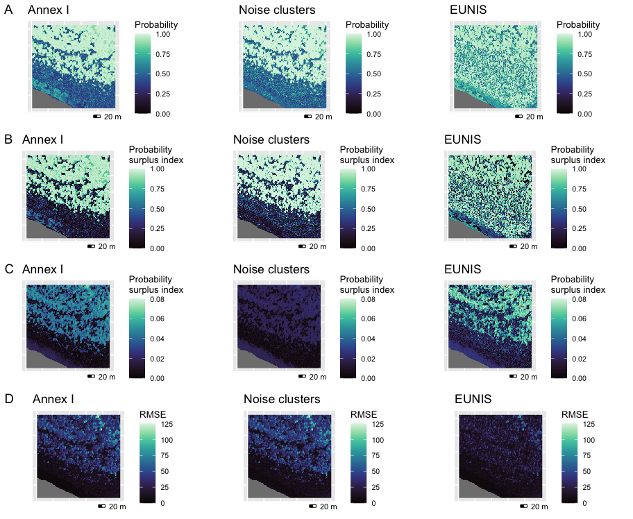<!-- -->

``` r
ggsave('FigS4.png',width=24,height=20,units='cm',bg='white')


plot_area2 <- plot_grid(
  plot_grid(plot_cr2a,plot_cr2b,plot_cr2c,nrow=1,rel_widths=c(1,1,1)), #crisp RF
  NULL,
  plot_grid(plot_psi2a,plot_psi2b,plot_psi2c, nrow=1,rel_widths=c(1,1,1)), #fuzzy RF
  NULL,
  plot_grid(plot_sam2a,plot_sam2b,plot_sam2c,nrow=1,rel_widths=c(1,1,1)),
  NULL,
  plot_grid(plot_mesma2a,plot_mesma2b,plot_mesma2c,nrow=1,rel_widths=c(1,1,1)),
  NULL,
  nrow=8,align='hv',rel_heights=c(1,.1,1,.1,1,.1,1,.1), 
  labels=c('A','','B','','C','','D',''),label_x = 0, label_fontface='plain')
plot_area2
```

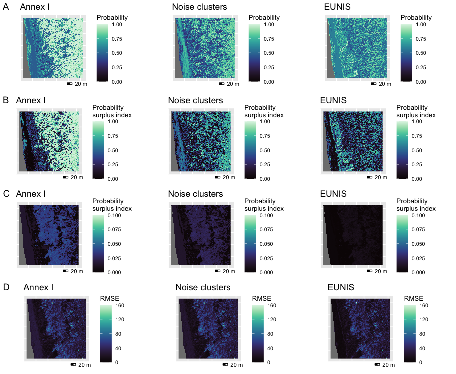<!-- -->

``` r
ggsave('FigS5.png',width=24,height=20,units='cm',bg='white')
```

# Overall accuracy

``` r
# load data
df_acc <- read.csv("results_accuracy.csv", stringsAsFactors=TRUE)
df_acc$class <- factor(df_acc$class, levels=c("RF crisp", "RF fuzzy", "SAM","MESMA"))
df_acc$park <- factor(df_acc$park, levels=c("MSRM", "Maremma"))

# graphical parameters
theme_plot <- theme_bw()+ 
  theme(strip.background=element_rect(color='lightgrey', fill="lightgrey", linewidth=.5, linetype='solid'),
        axis.text.y = element_text(angle=0,size = 10), #text Y axis
        axis.text.x = element_text(angle=0, size = 10), #text X axis
        axis.title = element_text(size = 12), #name Y axis
        axis.title.x = element_blank(), #name X axis
        strip.text = element_text(size = 12), #top label
        legend.title = element_text(size = 12), #legend title
        legend.text = element_text(size= 10), #legend content
        panel.grid.minor = element_blank())

# Overall accuracy
p1 <- ggplot(df_acc, aes(x=habitat ,y=oa, fill=class))+
  geom_bar(stat='identity',position=position_dodge())+
  scale_fill_viridis(discrete = TRUE, option='D')+
  facet_wrap(~park, drop=T)+
  labs(x='Vegetation classification',y='Overall accuracy', fill='Image classification')+
  theme_plot

# Mantel r
p2 <- ggplot(df_acc, aes(x=habitat ,y=mantel.stat, fill=class))+
  geom_bar(stat='identity',position=position_dodge())+
  scale_fill_viridis(discrete = TRUE, option='D')+
  scale_y_continuous(labels=function(x) format(x, nsmall=2))+ 
  facet_wrap(~park, drop=T)+
  labs(x='Vegetation classification',y='Mantel R', fill='Image classification')+
  theme_plot

ggarrange(p1, p2, nrow=2, common.legend=T, legend="right", labels="AUTO", font.label=list(face="plain"))
```

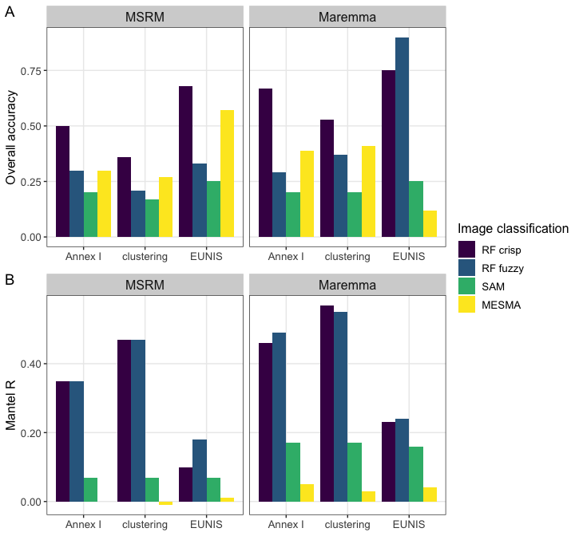<!-- -->

``` r
ggsave('Fig5.png', width=7.5, height=7, bg='transparent')
```

# Principal components analysis

``` r
name_bands <- paste0('B', seq(1:8))
labels_Nat2000 <- c('1210','2110','2120','2210','2230','2250')
labels_EUNIS <- c('N12','N14','N16','N1B')
labels_clust <- c('C1','C2','C3','C4','C5','C6')
name_classes <- c(labels_clust,labels_EUNIS,labels_Nat2000)

# graphical parameters
theme_pca <- theme_bw()+ 
  theme(panel.grid.minor = element_blank(),
        panel.grid.major = element_blank(),
        legend.box="horizontal")

# load WV band values for ground truth data
df_plots <- read.csv("plots_worldview.csv", stringsAsFactors=TRUE)

# load fuzzy membership from fuzzy RF map
df_fuzzy <- read.csv("plots_fuzzy_RF.csv", stringsAsFactors=TRUE)
names(df_fuzzy)[-1] <- name_classes
df_fuzzy$park <- df_plots$park

# function to create pca plots
create_pca_plot <- function(
    class, 
    class_type, #annex_I, cluster, eunis
    df_plots,
    df_fuzzy
    ){
  # add ground truth membership to class
  df_plots <- subset(df_plots, select=c("id", class_type))
  names(df_plots) <- c("id", "class_ground")
  
  wv_pca.sites$class <- ifelse(is.na(df_plots$class_ground) | df_plots$class_ground != class, "other", class)
  wv_pca.sites$type <- ifelse(df_plots$class_ground %in% class_values, "pure", "mix")
  
  # add fuzzy membership to class
  wv_pca.sites$prob <- df_fuzzy[match(wv_pca.sites$id, df_fuzzy$id), class]

  hull.data <- wv_pca.sites[wv_pca.sites$class==class,]
  hull.data <- hull.data[chull(wv_pca.sites[wv_pca.sites$class==class, c("PC1","PC2")]),]
  
  ggplot(wv_pca.sites, aes(x=PC1, y=PC2)) +
    geom_hline(yintercept=0, linewidth=.1) +
    geom_vline(xintercept=0, linewidth=.1) +
    ggtitle(paste0('Habitat ', class)) +
    geom_point(aes(color=prob, shape=type), size=1.5)+
    scale_color_gradient(low='lightblue', high='darkblue', name=("Membership\nto habitat"))+
    geom_polygon(data=hull.data, 
                 aes(x=PC1, y=PC2, fill=class, group=class),
                 alpha=0.30, show.legend=F) +
    theme_pca
}


### Maremma ******************************************************
aoi <- "Maremma"
shp_aoi <- df_plots[df_plots$park==aoi, ]

# pca
df_wv <- df_plots[df_plots$park==aoi, name_bands]
wv_pca <- rda(df_wv, scale=T)
wv_pca.sites <- as.data.frame(scores(wv_pca)$sites)
wv_pca.sites$id <- shp_aoi$id


# Annex I
class_values <- c('1210','2110','2120','2210','2250')
pca_plots_annexI <- lapply(
  class_values, 
  create_pca_plot,
  class_type ="annex_I",
  df_fuzzy = df_fuzzy[df_fuzzy$park==aoi,],
  df_plots = df_plots[df_plots$park==aoi,]
)
pA <- ggarrange(plotlist = pca_plots_annexI[1:length(pca_plots_annexI)], nrow=1, legend="none", common.legend=TRUE) 

# clusters
class_values <- c('C1','C2','C3','C4','C6')
pca_plots_clust <- lapply(
  class_values, 
  create_pca_plot,
  class_type ="cluster",
  df_fuzzy = df_fuzzy[df_fuzzy$park==aoi,],
  df_plots = df_plots[df_plots$park==aoi,]
)
pB <- ggarrange(plotlist = pca_plots_clust[1:length(pca_plots_clust)], nrow=1, legend="none", common.legend=TRUE) 

# EUNIS
class_values <- c('N12','N14','N16','N1B')
pca_plots_EUNIS <- lapply(
  class_values, 
  create_pca_plot,
  class_type ="eunis",
  df_fuzzy = df_fuzzy[df_fuzzy$park==aoi,],
  df_plots = df_plots[df_plots$park==aoi,]
)
pC <- ggarrange(plotlist = pca_plots_EUNIS[1:length(pca_plots_EUNIS)], nrow=1, legend="none", common.legend=TRUE) 

# complete plot
pca_plots_legend <- cowplot::get_legend(pca_plots_EUNIS[[1]])

plot_grid(pA, pB, plot_grid(pC, pca_plots_legend, ncol=2, rel_widths=c(4,1)),
          ncol=1, nrow=3, labels='AUTO', label_fontface='plain')
```

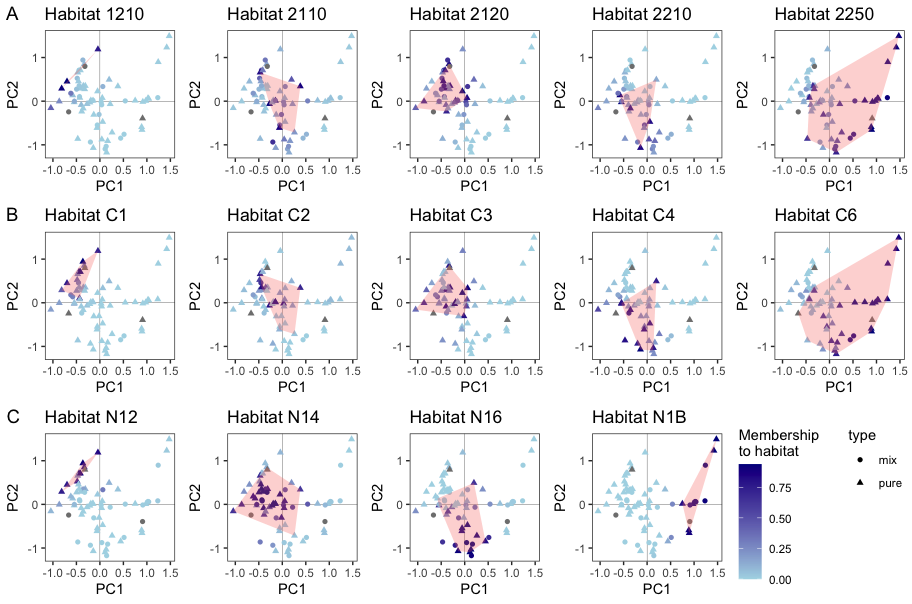<!-- -->

``` r
ggsave("Fig7.png", bg="transparent", width=24, height=16, units="cm", dpi=600)


### MSRM ******************************************************
aoi <- "MSRM"
shp_aoi <- df_plots[df_plots$park==aoi, ]

# pca
df_wv <- df_plots[df_plots$park==aoi, name_bands]
wv_pca <- rda(df_wv, scale=T)
wv_pca.sites <- as.data.frame(scores(wv_pca)$sites)
wv_pca.sites$id <- shp_aoi$id

# Annex I
class_values <- c('2110', '2120', '2210', '2230','2250')
pca_plots_annexI <- lapply(
  class_values, 
  create_pca_plot,
  class_type ="annex_I",
  df_fuzzy = df_fuzzy[df_fuzzy$park==aoi,],
  df_plots = df_plots[df_plots$park==aoi,]
)
pA <- ggarrange(plotlist = pca_plots_annexI[1:length(pca_plots_annexI)], nrow=1, legend="none", common.legend=TRUE) 

# clusters
class_values <- c('C1','C2','C3','C4','C5','C6')
pca_plots_clust <- lapply(
  class_values, 
  create_pca_plot,
  class_type ="cluster",
  df_fuzzy = df_fuzzy[df_fuzzy$park==aoi,],
  df_plots = df_plots[df_plots$park==aoi,]
)
pB <- ggarrange(plotlist = pca_plots_clust[1:length(pca_plots_clust)], nrow=1, legend="none", common.legend=TRUE) 

# EUNIS
class_values <- c('N12','N14','N16','N1B')
pca_plots_EUNIS <- lapply(
  class_values, 
  create_pca_plot,
  class_type ="eunis",
  df_fuzzy = df_fuzzy[df_fuzzy$park==aoi,],
  df_plots = df_plots[df_plots$park==aoi,]
)
pC <- ggarrange(plotlist = pca_plots_EUNIS[1:length(pca_plots_EUNIS)], nrow=1, legend="none", common.legend=TRUE) 

# complete plot
pca_plots_legend <- cowplot::get_legend(pca_plots_EUNIS[[1]])
plot_grid(plot_grid(pA, NULL, ncol=2, rel_widths=c(5,1)),
          pB, 
          plot_grid(pC, pca_plots_legend, ncol=2, rel_widths=c(4,2)),
          ncol=1, nrow=3, labels='AUTO', label_fontface='plain')
```

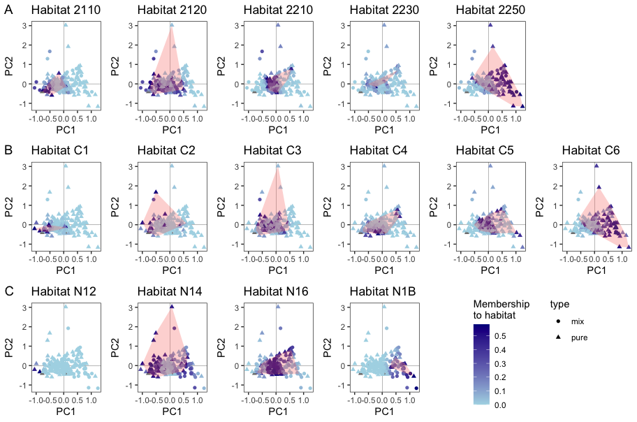<!-- -->

``` r
ggsave("FigS6.png", bg="transparent", width=24, height=16, units="cm", dpi=600)
```
